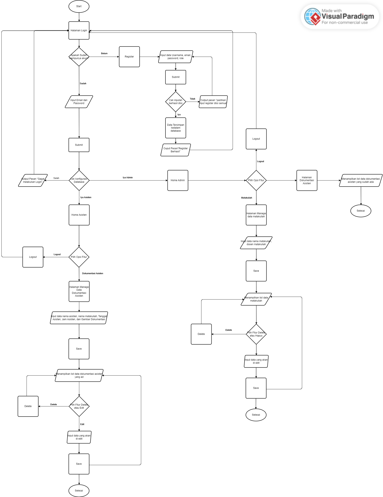
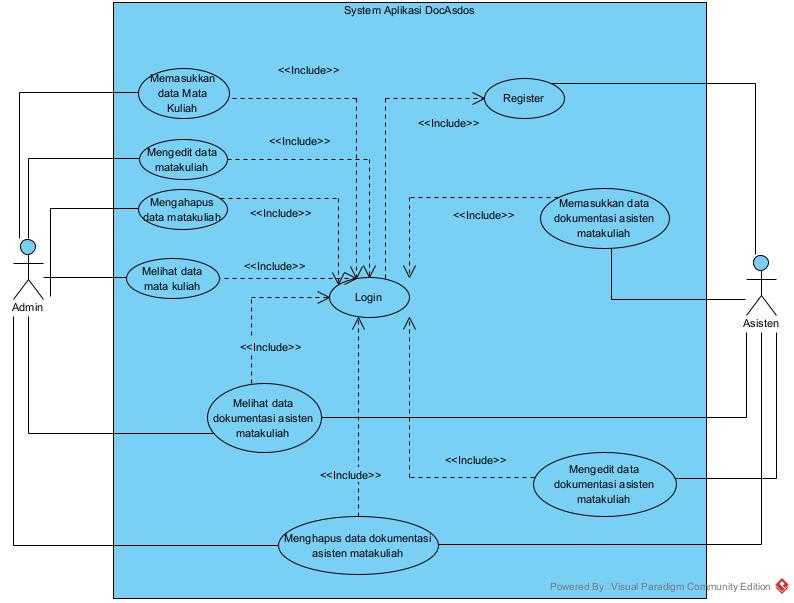

# DocAsdos

A new Flutter project.

## Deskripsi Aplikasi
Aplikasi ini berfungsi untuk memanage data dokumentasi asisten per matakuliah yang sedang mengasdos, lalu yang sebagai admin adalah staff tu bertugas untuk menginputkan nama matkul dan membaca dokumentasi asisten dosen. dan user satunya lagi adalah asisten itu sendiri yang bisa melakukan CRUD data dokumentasi yang berisikan data nama asisten, nama matakuliah yang sedang di asdos, tanggal asisten, jam asisten, dan gambar dokumentasi. kemudian data tersebut dapat di simpan kedalam firebase lalu ditampilkan dalam bentuk list dan juga bisa di edit maupun delete.

admin@admin.com
123456

## 1. Flowchart

## 2. UseCase

